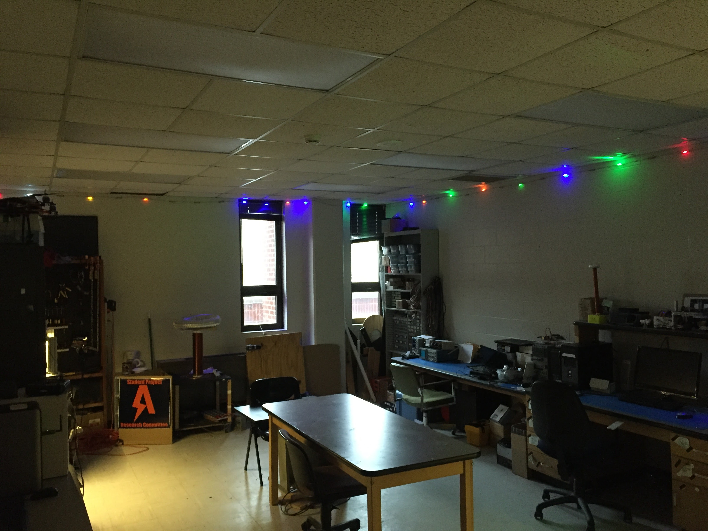

modular-lights
==============

</img>

A project for making controllable modular lights for the SPARC lab. The lights are small LED strips that magnetically attach to a fabricated wire that spans across the top perimeter of the lab.  The LED's are controlled by an H-Bridge driven by an Arduino.  The system is contained in a small plastic exposure with four buttons to control the LCD interface to change settings.

</img>
